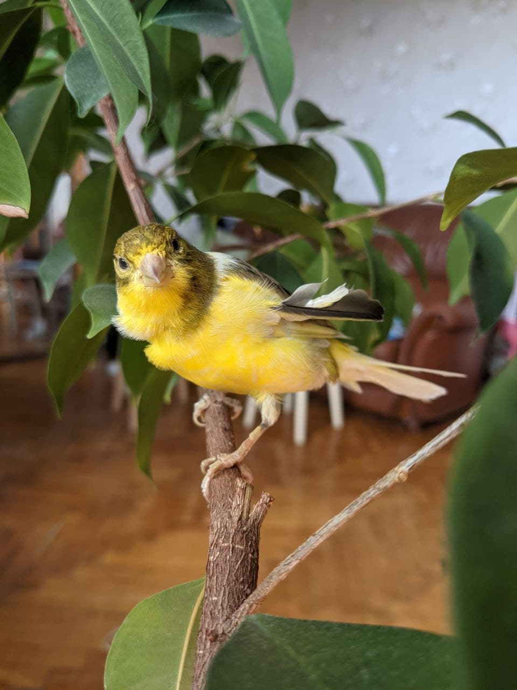

```{r setup, include=FALSE}
knitr::opts_chunk$set(
  fig.path="figs/", 
  echo=TRUE, 
  warning=FALSE, 
  message=FALSE, 
  fig.retina=3,
  fig.asp=.5, 
  fig.align = "center",
  out.width="80%", 
  # fig.showtext = TRUE, # for using showtext lib in R graphs
  comment = "")

# libraries to run code in slides
library(tidyverse)


# library(showtext)
# font_add_google("Bitter", "Bitter")
# showtext_auto()
# theme_set(theme_minimal(base_family = "Bitter"))

# # for colors
# pkg_colors <- c("palmerpenguins" = "#7899d4", 
#                 "blogdown" = "#f5ab1f", 
#                 "distill" = "#b74f6f")

# Xaringan extra features
# devtools::install_github("gadenbuie/xaringanExtra")
# library(xaringanExtra)
xaringanExtra::use_tile_view() # включить вид с панельками (tile view) - жамкнуть O
xaringanExtra::use_panelset() # возможность создания нескольких вкладок на одном слайде
xaringanExtra::use_editable() # возможность "дописывать" что-то на слайдах во время показа презентации
xaringanExtra::use_fit_screen() # Alt+F to fit slides to screen

# # возможность копировать код одним кликом
# # xaringanExtra::use_clipboard() 
# htmltools::tagList(
#   xaringanExtra::use_clipboard(
#     button_text = "<i class=\"fa fa-clipboard\" style=\"font-size: 1pt\"></i>",
#     success_text = "<i class=\"fa fa-check\" style=\"color: #90BE6D\"></i>",
#     error_text = "<i class=\"fa fa-times-circle\" style=\"color: #F94144\"></i>"
#   ),
#   rmarkdown::html_dependency_font_awesome()
# )

# Insert icons from https://fontawesome.com/
# install.packages("fontawesome")
# library(fontawesome)

# Insert emojis
# devtools::install_github("hadley/emo")
# library(emo)

# Flipbook features
# devtools::install_github("EvaMaeRey/flipbookr")
# library(flipbookr)
```


# Куда жамкать, чтобы было красивенько?

- Жамкай `F`, чтобы запустить полноэкранный режим

- Жамкай `P`, чтобы включить режим докладчика 

- Жамкай `O`, чтобы включить .red[tile view]

- Если не работает *проверь раскладку!*

- ... или начинай строчить жалобы `r emo::ji("poop")`
---

# Где еще почитать про .purple[*xaringan*]  `r emo::ji("spy")`?

1. [Yihui's ***R Markdown: The Definitive Guide***](https://bookdown.org/yihui/rmarkdown/xaringan.html)

1. Презентации:

    - [Xaringan slides by Alison Hill](https://apreshill.github.io/data-vis-labs-2018/slides/06-slides_xaringan.html)
    
    - [Extra Awesome Xaringan Presentations](http://pkg.garrickadenbuie.com/extra-awesome-xaringan/intro/index.html)

    - [Presentation Ninja](https://slides.yihui.org/xaringan/) `r fontawesome::fa("user-ninja", fill = "black")`

1. **Погугли!**
    
???

Тут написал заметки. Тут же их прочитал в режиме докладчика.

---
class: inverse, center, middle

# Рецепт борща №1

---

# Не будет никакого рецепта

<br> 

## Будем кодить!

Так нужно устанавливать пакеты и их загружать:

```{r eval=FALSE}
install.packages("tidyverse")
library(tidyverse)
```

--

А это _incremental slide_.

```{r tidy=TRUE}
1 + 1
```

--

Еще разок. 

---

class: top, center
background-image: url("img/r_rollercoaster.png")
background-size: contain


# `r fontawesome::fa("r-project", fill = "#b74f6f")` сложный?

---

# Можно писать и тут, и там

.pull-left.can-edit.cats[

### Кто хороший котик?

- Мишенька,  

- Маруся,

- ... .gray[*тут можно дописать*]


Hey there, there's a &#x1F408; over &#x1F449;
]

.pull-right[

```{r misha_1, echo=FALSE}

```

]


---

# Code styling

Это пример inline кода: `library(tidyverse)`


--

А это пример блока кода:

```{r out.width='70%'}
library(ggplot2)

ggplot(mtcars, aes(x = wt,y = mpg, col = cyl)) + 
  geom_point() + 
  facet_grid(am~cyl)
```


---

```{r my_cars, include = FALSE}
as_tibble(cars) %>% 
  ggplot() + #BREAK
  aes(x = speed) + #BREAK
  aes(y = dist) + #BREAK
  geom_point(
             shape = 21,
             size = 7, #BREAK2
             color = "magenta", #BREAK3
             alpha = .8 #BREAK4
             ) + #BREAK
  aes(fill = speed) + #BREAK
  scale_fill_viridis_c() + 
  theme_minimal() #BREAK
```

# Тестим `flipbookr`!

Почитать про Flipbook можно [здесь](https://evamaerey.github.io/flipbooks/flipbook_recipes) или [здесь](https://github.com/EvaMaeRey/flipbookr).

---

`r flipbookr::chunk_reveal(chunk_name = "my_cars", break_type = "user", title = "# Flipbook работает что ли?!")`

---

`r flipbookr::chunk_reveal(chunk_name = "my_cars", break_type = "non_seq", title = "# Теперь немного по-другому!")`

---

Можно и просто подсвечивать код без всяких там флипбуков. Хорошо работает добавление комментария `#<<` в конце строки, которую нужно подсветить.

```{r no_flipbook, out.width='50%'}
as_tibble(cars) %>% 
  ggplot() + 
  aes(x = speed) + 
  aes(y = dist) + 
  geom_point(shape = 21, size = 7, color = "magenta", alpha = .8) + 
  aes(fill = speed) + 
  scale_fill_viridis_c() + 
  theme_minimal() #<<
```

---

Можно хранить всякое в отдельном `.R` скрипте и подгружать его, когда нужно.

```{r external, echo=FALSE, cache=FALSE}
source('R/test.R')
```

```{r}
paste(a + b, "долматинец")
```

.small[Откуда взялись `a` и `b` смотри в `.Rmd` файле этих слайдов!]

---

class: inverse, middle, center

# Всякое разное

---

# Math Expressions

You can write LaTeX math expressions inside a pair of dollar signs, e.g. &#36;\alpha+\beta$ renders $\alpha+\beta$. You can use the display style with double dollar signs:

```
$$\bar{X}=\frac{1}{n}\sum_{i=1}^nX_i$$
```

$$\bar{X}=\frac{1}{n}\sum_{i=1}^nX_i$$

Limitations:


1. .small[The source code of a LaTeX math expression must be in one line, unless it is inside a pair of double dollar signs, in which case the starting `$$` must appear in the very beginning of a line, followed immediately by a non-space character, and the ending `$$` must be at the end of a line, led by a non-space character;]

1. .small[There should not be spaces after the opening `$` or before the closing `$`.]


---

# Таблицы

```{r}
iris %>% as_tibble()
```

---

# Таблицы

If you want to generate a table, make sure it is in the HTML format (instead of Markdown or other formats), e.g.,

```{r iris_table}
knitr::kable(head(iris), format = "html", caption = "Iris table")
```

---

# HTML Widgets

HTML widgets have not been thoroughly tested against **xaringan**. Some may work well, and some may not. It is a little tricky.

```{r eval=require('DT'), tidy=FALSE}
DT::datatable(
  head(iris, 10),
  caption = "Another iris table",
  fillContainer = FALSE, 
  options = list(pageLength = 3, dom = "t")
)
```


---

# Тишина! Идет подсчет котиков!

.left-column[
## Сколько котиков?

### - Котик раз
]

.right-column[
```{r misha_2, echo=FALSE, out.width='60%'}

```
]


---

# Тишина! Идет подсчет котиков!


.left-column[
## Сколько котиков?

### - Котик раз
### - Котик два
]

.right-column[
```{r marusya, echo=FALSE, out.width='60%'}

```
]

---

# Тишина! Идет подсчет котиков!


.left-column[
## Сколько котиков?

### - Котик раз
### - Котик два
### - Котик три
]

.right-column[
```{r shurup, echo=FALSE, out.width='60%'}

```
]

---

# Тишина! Идет подсчет котиков!

.left-column[
## Сколько котиков?

### - Котик раз
### - Котик два
### - Котик три
]

.right-column[
# Стоп! 

## А это точно был котик???
]

---

background-image: url("img/butterflies.png")
background-repeat: no-repeat
background-size: 75%

# Footnote & blockquote


.pull-right[
> Пока footnote работает не очень. Не поменять размер шрифта!
> Да и blockquote не очень.
]

.footnote[
Jay, P., Chouteau, M., Whibley, A. et al. Mutation load at a mimicry supergene sheds new light on the evolution of inversion polymorphisms. Nat Genet 53, 288–293 (2021). https://doi.org/10.1038/s41588-020-00771-1
]

---

class: center, middle

# Спасибо!

## Наконец-то можно пойти поесть!.. 


